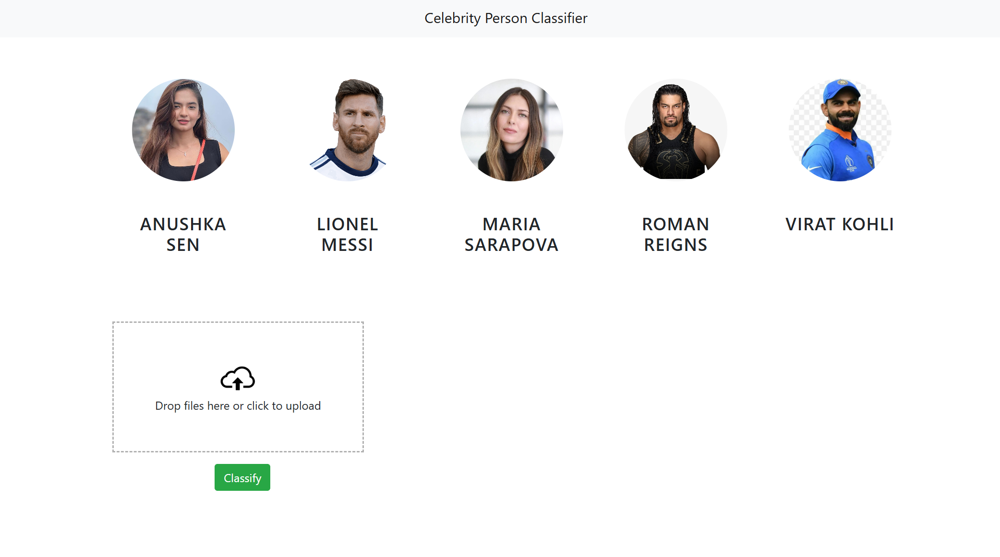

# Celebrity-Image-Classifier

In this data science and machine learning project, we classify sports personalities. We restrict classification to only 5 people,
1) Anushka Sen
2) Lionel Messi
3) Maria Sarapova
4) Roman Reigns
5) Virat Kohli

Here is the folder structure,
* UI : This contains ui website code 
* server: Python flask server
* model: Contains python notebook for model building
* images_dataset: Dataset used for our model training

Technologies used in this project,
1. Python
2. Numpy and OpenCV for data cleaning
3. Matplotlib & Seaborn for data visualization
4. Sklearn for model building
5. Jupyter notebook, visual studio code and pycharm as IDE
6. Python flask for http server
7. HTML/CSS/Javascript for UI

## Dataset
The dataset used for this project is available on Google Drive:  
[Download Dataset](https://drive.google.com/drive/folders/1ES_q36wMTll1JJGfZ4C9Nwrvo_K4hHwL?usp=drive_link)
